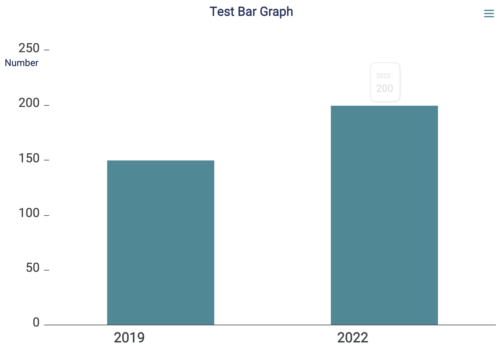

<!-- README.md is generated from README.Rmd. Please edit that file -->

# naccho.viz

<!-- badges: start -->
<!-- badges: end -->

Create NACCHO-themed data visualizations using the {highcharter}
package. For information on the highcharts license, visit [their
website.](https://shop.highcharts.com/?gad_source=1&gclid=CjwKCAjwmYCzBhA6EiwAxFwfgGobLdIzZ30MDAVCQyV65AQT8dhWcVyxd6IkG4ikps4zGrXAQvFkLhoCtzsQAvD_BwE)

## Installation

You can install the development version of naccho.viz from
[GitHub](https://github.com/) with:

``` r
# install.packages("devtools")
devtools::install_github("madalder/naccho.viz")
```

## Example

This is a basic example of a single bar chart:

``` r
#| message: FALSE
#| evaluate: FALSE

library(naccho.viz)
## basic example code

test_data <- data.frame(
  year = c("2019", "2022"),
  value = c(150, 200)
)

create_single_bar(
  data = test_data,
  x_variable = "year",
  y_variable = "value",
  y_label = "Number",
  title_text = "Test Bar Graph",
  y_max = 250,
  tooltip = "{point.value}"
)
```

## Figure


